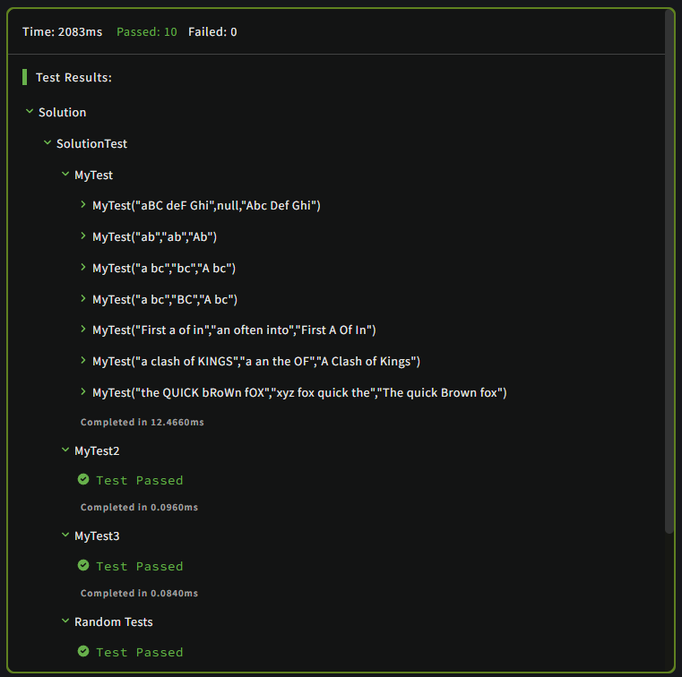

# Title Case

[Click here to access this kata](https://www.codewars.com/kata/5202ef17a402dd033c000009)

A string is considered to be in title case if each word in the string is either (a) capitalised (that is, only the first letter of the word is in upper case) or (b) considered to be an exception and put entirely into lower case unless it is the first word, which is always capitalised.
<br>

Write a function that will convert a string into title case, given an optional list of exceptions (minor words). The list of minor words will be given as a string with each word separated by a space. Your function should ignore the case of the minor words string -- it should behave in the same way even if the case of the minor word string is changed.
<br>

## Arguments (Haskell)
<strong>First argument:</strong> space-delimited list of minor words that must always be lowercase except for the first word in the string.<br>
<strong>Second argument:</strong> the original string to be converted.<br>

## Arguments (Other languages)
<strong>First argument (required):</strong> the original string to be converted.<br>
<strong>Second argument (optional):</strong> space-delimited list of minor words that must always be lowercase except for the first word in the string. The JavaScript/CoffeeScript tests will pass undefined when this argument is unused.<br>

### Example
```
Kata.TitleCase("a clash of KINGS", "a an the of")   => "A Clash of Kings"
Kata.TitleCase("THE WIND IN THE WILLOWS", "The In") => "The Wind in the Willows"
Kata.TitleCase("the quick brown fox")               => "The Quick Brown Fox"
```
<br>


