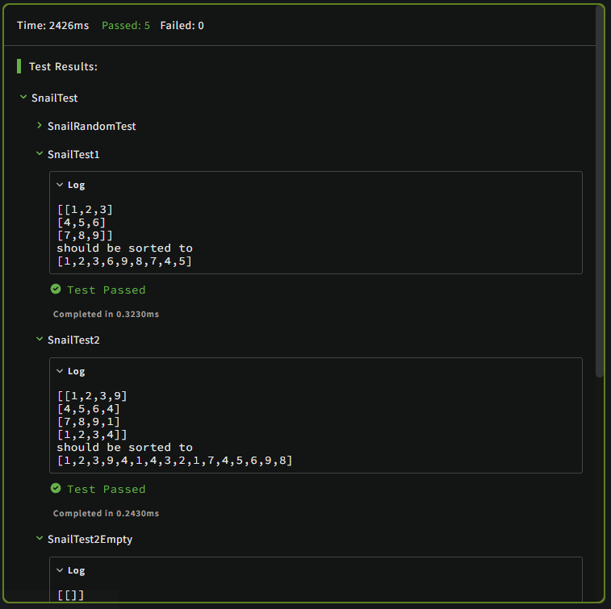

# Snail

[Click here to access this kata](https://www.codewars.com/kata/521c2db8ddc89b9b7a0000c1)

## Snail Sort

Given an `n x n` array, return the array elements arranged from outermost elements to the middle element, traveling clockwise.
<br>

```
array = [[1,2,3],
         [4,5,6],
         [7,8,9]]
snail(array) #=> [1,2,3,6,9,8,7,4,5]
```
<br>

For better understanding, please follow the numbers of the next array consecutively:
<br>

```
array = [[1,2,3],
         [8,9,4],
         [7,6,5]]
snail(array) #=> [1,2,3,4,5,6,7,8,9]
```
<br>

This image will illustrate things more clearly:
<br>


<strong>NOTE:</strong> The idea is not sort the elements from the lowest value to the highest; the idea is to traverse the 2-d array in a clockwise snailshell pattern.
<br>

<strong>NOTE 2:</strong> The 0x0 (empty matrix) is represented as en empty array inside an array `[[]]`.
<br>


