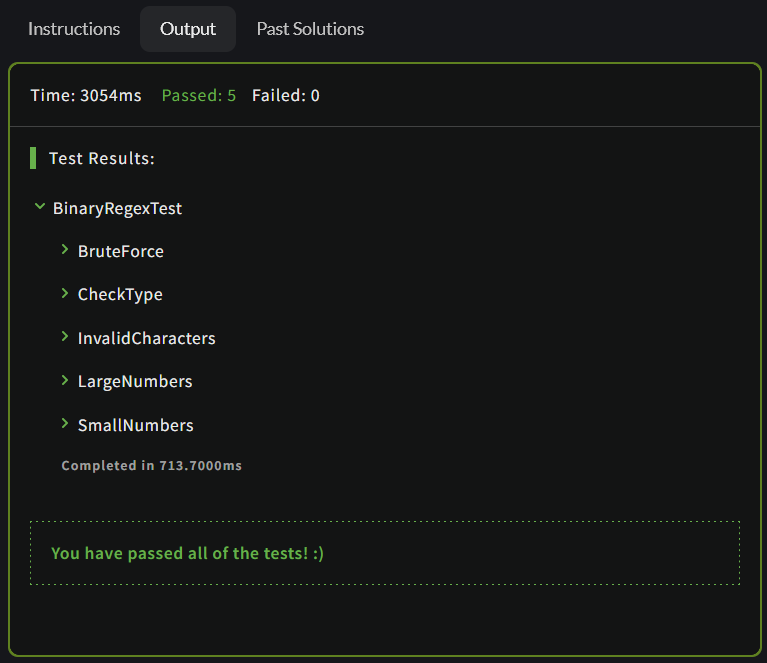

## Binary multiple of 3

In this kata, your task is to create a regular expression capable of evaluating binary strings (strings with only 1s and 0s) and determining whether the given string represents a number divisible by 3.

Take into account that:

    An empty string might be evaluated to true (it's not going to be tested, so you don't need to worry about it - unless you want)
    The input should consist only of binary digits - no spaces, other digits, alphanumeric characters, etc.
    There might be leading 0s.

Examples (Javascript)
```
    multipleof3Regex.test('000') should be true
    multipleof3Regex.test('001') should be false
    multipleof3Regex.test('011') should be true
    multipleof3Regex.test('110') should be true
    multipleof3Regex.test(' abc ') should be false
```

You can check more in the example test cases
Note

There's a way to develop an automata (FSM) that evaluates if strings representing numbers in a given base are divisible by a given number. You might want to check an example of an automata for doing this same particular task here.

If you want to understand better the inner principles behind it, you might want to study how to get the modulo of an arbitrarily large number taking one digit at a time.

