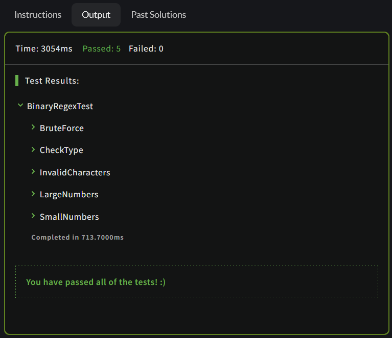
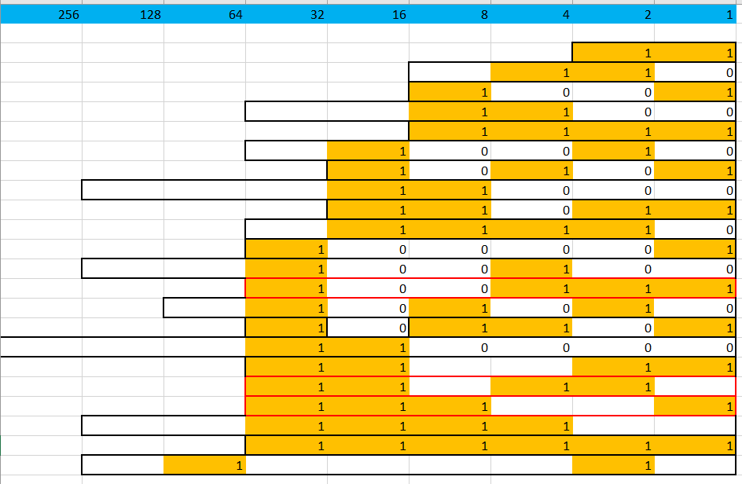

## Binary multiple of 3

In this kata, your task is to create a regular expression capable of evaluating binary strings (strings with only 1s and 0s) and determining whether the given string represents a number divisible by 3.

Take into account that:

    An empty string might be evaluated to true (it's not going to be tested, so you don't need to worry about it - unless you want)
    The input should consist only of binary digits - no spaces, other digits, alphanumeric characters, etc.
    There might be leading 0s.

Examples (Javascript)
```
    multipleof3Regex.test('000') should be true
    multipleof3Regex.test('001') should be false
    multipleof3Regex.test('011') should be true
    multipleof3Regex.test('110') should be true
    multipleof3Regex.test(' abc ') should be false
```

You can check more in the example test cases
Note

There's a way to develop an automata (FSM) that evaluates if strings representing numbers in a given base are divisible by a given number. You might want to check an example of an automata for doing this same particular task here.

If you want to understand better the inner principles behind it, you might want to study how to get the modulo of an arbitrarily large number taking one digit at a time.



Click [_here_](https://www.codewars.com/kata/54de279df565808f8b00126a/csharp) to go to the kata


How to solve?


As we can see in the image,numbers that are multiple of three in many cases follow a kind of pattern,
the number starts with 0 if the number ends with 0, and starts with 1 if it ends with one. Also they
are some kind of mirror if we cut them in the middle like the cases in squared in black borders. For example:
```
1   1  => Starts with 1, ends with 1
1	0	0	1 => starts with 1  0 , ends with 0 1
1	0	1	1	0	1  => starts with 101 ends with 101

```

There are also special cases, the ones in red border. 
What does the following regex expression ^(0*(1(01*0)*1)*)*$  ?

1.- it matches strings starting with 0 or 1
2.- the * to repeat a pattern
3.- not in all the cases we can match expressions that meet with the mirror thingy. Thats because we
    need to group.
4.- even that this pattern gets all multiples of three, but alse there are some little cases that 
    matches with non-multiples of three, because of the mirror thingy. For example: 110011
