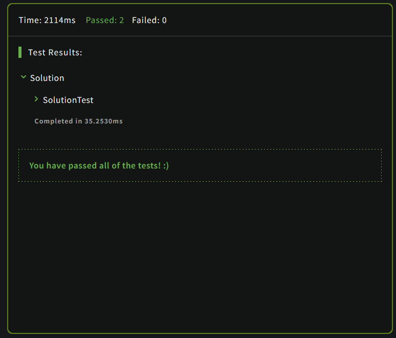

## IP Validation

Write an algorithm that will identify valid IPv4 addresses in dot-decimal format. IPs should be considered valid if they consist of four octets, with values between 0 and 255, inclusive.
Valid inputs examples:

Examples of valid inputs:
```
1.2.3.4
123.45.67.89
```
Invalid input examples:
```
1.2.3
1.2.3.4.5
123.456.78.90
123.045.067.089
```
Notes:

    Leading zeros (e.g. 01.02.03.04) are considered invalid
    Inputs are guaranteed to be a single string





Click [_here_](https://www.codewars.com/kata/515decfd9dcfc23bb6000006) to go to the kata


How to solve?
 ```
^(25[0-5]|2[0-4][0-9]|1[0-9]{2}|[1-9][0-9]|[0-9])\.(25[0-5]|2[0-4][0-9]|1[0-9]{2}|[1-9][0-9]|[0-9])\.(25[0-5]|2[0-4][0-9]|1[0-9]{2}|[1-9][0-9]|[0-9])\.(25[0-5]|2[0-4][0-9]|1[0-9]{2}|[1-9][0-9]|[0-9])$
```
First we need to find a pattern that gets all numbers from 0 to 255,
and this pattern is going to be repeated 4 times.
In the first case:
the number starts with 25 and can be followed by any number from 0 to 4
or 
if it starts with 2 the next number is from 0 to 4, and the third digit from 0 to 9
or 
if it starts with 1 the next number is from 0 to 9, and the third digit is the same like before [0-9]
or
if the number has 2 digits, we start from 1 to 9, excluding 0 like it is said in the kata. And the second digit from 0 to 9
or
if it has only one digit, it starts from 0 to 9
