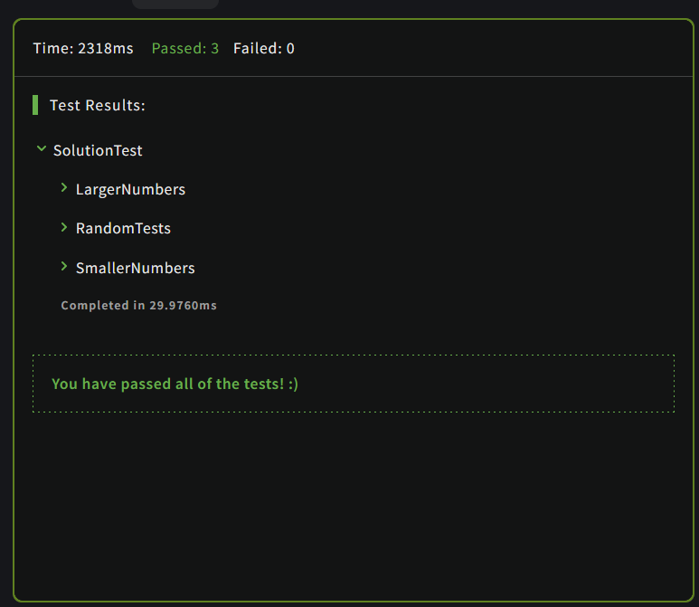

## Number of Proper Fractions with Denominator d

If n is the numerator and d the denominator of a fraction, that fraction is defined a (reduced) proper fraction if and only if GCD(n,d)==1.

For example 5/16 is a proper fraction, while 6/16 is not, as both 6 and 16 are divisible by 2, thus the fraction can be reduced to 3/8.

Now, if you consider a given number d, how many proper fractions can be built using d as a denominator?

For example, let's assume that d is 15: you can build a total of 8 different proper fractions between 0 and 1 with it: 1/15, 2/15, 4/15, 7/15, 8/15, 11/15, 13/15 and 14/15.

You are to build a function that computes how many proper fractions you can build with a given denominator:
```
proper_fractions(1)==0
proper_fractions(2)==1
proper_fractions(5)==4
proper_fractions(15)==8
proper_fractions(25)==20
```
Be ready to handle big numbers.

