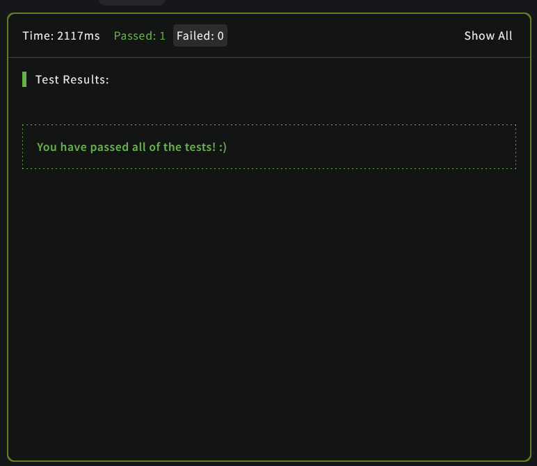

## Text Align Justify

Your task in this Kata is to emulate text justification in monospace font. You will be given a single-lined text and the expected justification width. The longest word will never be greater than this width.

Here are the rules:

    Use spaces to fill in the gaps between words.
    Each line should contain as many words as possible.
    Use '\n' to separate lines.
    Gap between words can't differ by more than one space.
    Lines should end with a word not a space.
    '\n' is not included in the length of a line.
    Large gaps go first, then smaller ones ('Lorem--ipsum--dolor--sit-amet,' (2, 2, 2, 1 spaces)).
    Last line should not be justified, use only one space between words.
    Last line should not contain '\n'
    Strings with one word do not need gaps ('somelongword\n').

Example with width=30:
```
Lorem  ipsum  dolor  sit amet,
consectetur  adipiscing  elit.
Vestibulum    sagittis   dolor
mauris,  at  elementum  ligula
tempor  eget.  In quis rhoncus
nunc,  at  aliquet orci. Fusce
at   dolor   sit   amet  felis
suscipit   tristique.   Nam  a
imperdiet   tellus.  Nulla  eu
vestibulum    urna.    Vivamus
tincidunt  suscipit  enim, nec
ultrices   nisi  volutpat  ac.
Maecenas   sit   amet  lacinia
arcu,  non dictum justo. Donec
sed  quam  vel  risus faucibus
euismod.  Suspendisse  rhoncus
rhoncus  felis  at  fermentum.
Donec lorem magna, ultricies a
nunc    sit    amet,   blandit
fringilla  nunc. In vestibulum
velit    ac    felis   rhoncus
pellentesque. Mauris at tellus
enim.  Aliquam eleifend tempus
dapibus. Pellentesque commodo,
nisi    sit   amet   hendrerit
fringilla,   ante  odio  porta
lacus,   ut   elementum  justo
nulla et dolor.
```
Also you can always take a look at how justification works in your text editor or directly in HTML (css: text-align: justify).

Have fun :)




Click [_here_](https://www.codewars.com/kata/537e18b6147aa838f600001b) to go to the kata