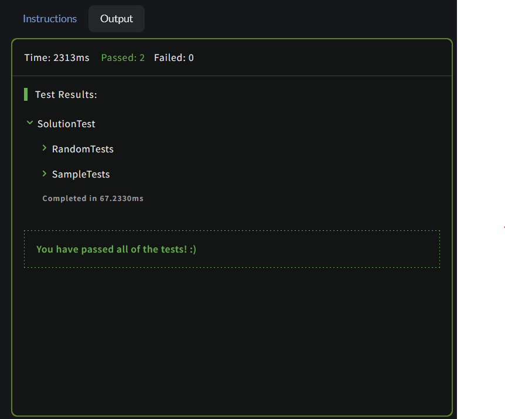

## The boolean order

In this Kata, you will be given boolean values and boolean operators. Your task will be to return the number of arrangements that evaluate to True.

t,f will stand for true, false and the operators will be Boolean AND (&), OR (|), and XOR (^).

For example, solve("tft","^&") = 2, as follows:
```
    "((t ^ f) & t)" = True
    "(t ^ (f & t))" = True
```
Notice that the order of the boolean values and operators does not change. What changes is the position of braces.

More examples in the test cases.

Good luck!




Click [_here_](https://www.codewars.com/kata/59eb1e4a0863c7ff7e000008) to go to the kata